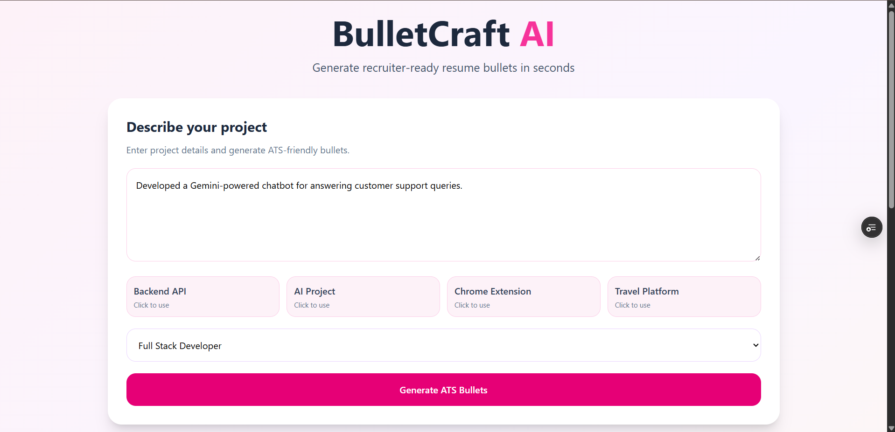
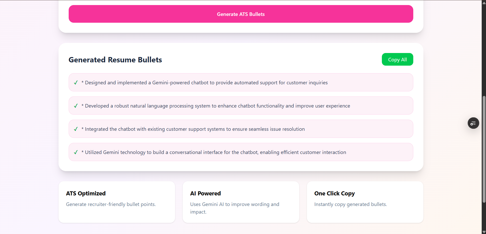

# 🚀 BulletCraft AI

AI-powered resume bullet generator that transforms project descriptions into ATS-friendly resume achievements.

## 🌐 Live Demo

**Frontend:** https://hero-bullet-ai.vercel.app

**API Documentation:** https://hero-bullet-ai.onrender.com/docs

---

## 📌 Overview

BulletCraft AI helps students, developers, and job seekers create professional, recruiter-friendly resume bullet points from simple project descriptions.

Instead of spending time manually writing resume achievements, users can describe their project, select a target role, and instantly generate polished ATS-friendly bullet points using AI.

---

## ✨ Features

* AI-powered resume bullet generation
* ATS-friendly formatting
* Role-specific bullet customization
* Interactive example prompts
* One-click copy functionality
* Modern responsive UI
* Fast and scalable API backend
* Cloud deployment

---

## 🛠️ Tech Stack

### Frontend

* React
* Vite
* CSS3

### Backend

* FastAPI
* Python
* Groq API
* Llama Models

### Deployment

* Vercel (Frontend)
* Render (Backend)

---

## 🏗️ System Architecture

```text
                ┌─────────────┐
                │    User     │
                │  React UI   │
                └──────┬──────┘
                       │
                       ▼
            ┌──────────────────┐
            │ FastAPI Backend  │
            │   /generate      │
            └────────┬─────────┘
                     │
                     ▼
             ┌──────────────┐
             │   Groq API   │
             │ Llama Models │
             └──────┬───────┘
                    │
                    ▼
        ATS-Friendly Resume Bullets
```

---

## 📸 Screenshots

### Home Screen



### Generated Resume Bullets



---

## ⚙️ How It Works

1. Enter your project description.
2. Select your target role.
3. Click **Generate ATS Bullets**.
4. AI processes the description.
5. Receive recruiter-ready resume bullet points.

---

## 🚀 Local Setup

### Clone Repository

```bash
git clone https://github.com/IlmaxRehman/hero-bullet-ai.git

cd hero-bullet-ai
```

### Backend Setup

```bash
cd backend

pip install -r requirements.txt

uvicorn main:app --reload
```

Create a `.env` file:

```env
GROQ_API_KEY=your_api_key_here
```

### Frontend Setup

```bash
cd frontend

npm install

npm run dev
```

---

## 🔌 API Endpoint

### Generate Resume Bullets

**POST** `/generate`

Request:

```json
{
  "project_description": "Built a FastAPI backend using Redis and Celery for transaction processing.",
  "role": "Backend Developer"
}
```

Response:

```json
{
  "success": true,
  "bullets": "Generated ATS-friendly resume bullet points..."
}
```

---

## 🎯 Use Cases

* Resume Enhancement
* Internship Applications
* Placement Preparation
* LinkedIn Profile Improvements
* Portfolio Project Documentation

---

## 🔮 Future Improvements

* Resume PDF Export
* LinkedIn Optimization Mode
* Cover Letter Generation
* Multiple Writing Styles
* Resume Scoring System
* Job Description Matching

---

## 👩‍💻 Author

**Ilma Rehman**

B.Tech Computer Science Engineering

GitHub: https://github.com/IlmaxRehman

---

⭐ If you found this project useful, consider giving it a star.
